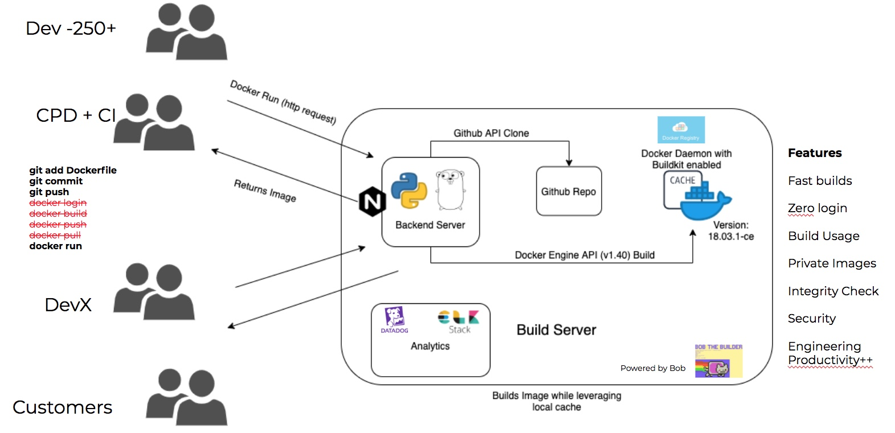

# btc-dockerbuilder
Bob, the cat, lightening fast docker build server

* Image file size
*Builds take a long time
* Docker build, run, pull usage unknown
* Repetitive with many layers
* Images are built on multiple hosts, multiple times
* Productive time lost

# Why use centralized docker server
* Fast builds
* Zero login
* Build Usage
* Private Images
* Integrity Check
* Security
* Engineering Productivity++

# Architecture

# Setup
* Install Go version 1.14+
* export $GOROOT=<path to go installation folder>
* export $GOPATH=<path to working dir>
* export PATH=$PATH:$GOROOT/bin:$GOPATH/bin
* add to /etc/hosts -> 127.0.0.1       bob.run
* cd $GOPATH && mkdir src bin pkg
* go get github.com/mohnisbasha/btc-dockerbuilder
* cd $GOPATH/src/mohnishbasha/btc-dockerbuilder
* go build .
* launch executable: ./btc-dockerbuilder
* from a different terminal: docker run bob.run:8080/github.com/mohnishbasha/hello-world

# Contributors
* Mohinish Shaikh
* James Kao
